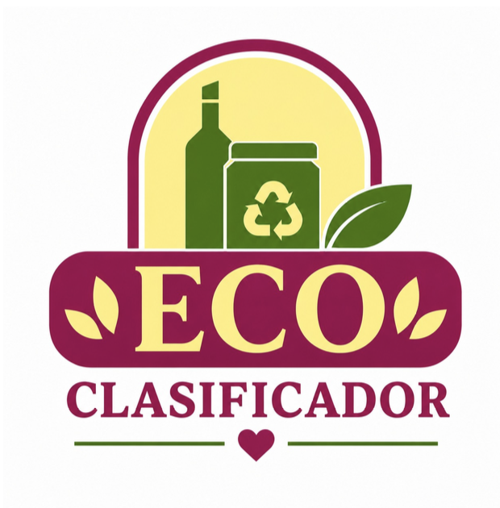

<div align="center">



# EcoClasificador

**Reciclá mejor. Una foto basta.**

Aplicación web que clasifica residuos a partir de una foto usando visión computacional, para fomentar el reciclaje correcto. Subís una imagen del residuo y el sistema la clasifica en una de las **9 categorías del dataset RealWaste** y recomienda el contenedor adecuado.

Proyecto integrador universitario · **UPATecO Salta · 2026**.

[](https://clasificadorresiduo.lat)
[](https://railway.app/)
[](LICENSE)
[](https://nextjs.org/)
[](https://fastapi.tiangolo.com/)

Demo: **https://clasificadorresiduo.lat**

</div>

---

## Visión general

EcoClasificador es un **proyecto académico integrador** que demuestra cómo reducir la fricción del reciclaje doméstico mediante visión computacional. El flujo es simple:

1. El usuario sube una foto del residuo.
2. La imagen se preprocesa (resize 224×224, normalización ImageNet).
3. Un modelo **ResNet50** con transfer learning infiere la categoría sobre **ONNX Runtime**.
4. La aplicación devuelve la clase predicha, la distribución de probabilidades sobre las 9 categorías y recomienda el contenedor de reciclaje correcto.

El repositorio es un **monorepo**: el frontend está hecho en Next.js con animaciones fluidas, y el backend en FastAPI dentro de un contenedor Docker.

> **Nota sobre métricas**: las métricas de exactitud del modelo (accuracy, F1, matriz de confusión) están **pendientes de medición sobre el conjunto de test**. No se reportan valores en este documento para no afirmar resultados aún no verificados.

---

## Stack tecnológico

### Frontend
- **Next.js 14** (App Router)
- **React 18** + **TypeScript**
- **Tailwind CSS 3.4**
- **Framer Motion 11** (animaciones)
- **Lenis** (smooth scroll)
- **Swiper** (carruseles)
- Deploy en **Vercel** → https://clasificadorresiduo.lat

### Backend
- **FastAPI 0.111**
- **ONNX Runtime** (inferencia)
- **Python 3.12**
- **Docker**
- Deploy en **Railway**

Endpoints:

| Método | Ruta | Descripción | Respuesta |
| ------ | ---- | ----------- | --------- |
| `GET`  | `/health` | Healthcheck | `{"status":"ok"}` |
| `POST` | `/api/v1/predict` | Clasifica una imagen (`multipart/form-data`, campo `file`) | `{predicted_class, probabilities:[{class_name, probability}]}` |

Ejemplo de respuesta de `POST /api/v1/predict`:

```json
{
  "predicted_class": "Plastic",
  "probabilities": [
    { "class_name": "Plastic", "probability": 0.95 },
    { "class_name": "Metal",   "probability": 0.03 }
  ]
}
```

### Modelo
- **ResNet50** con **transfer learning** sobre el dataset **RealWaste** (UCI Machine Learning Repository, licencia CC BY 4.0).
- 9 categorías: Cardboard, Food Organics, Glass, Metal, Miscellaneous Trash, Paper, Plastic, Textile Trash, Vegetation.

---

## Cómo correrlo en local

### Prerequisitos
- Node.js ≥ 18
- Python 3.12
- Docker (opcional, para el backend)

### Frontend (Next.js)

```bash
npm install
npm run dev          # http://localhost:3000
```

Configurá la variable de entorno copiando el ejemplo:

```bash
cp .env.example .env
```

```env
# .env
NEXT_PUBLIC_API_URL=http://127.0.0.1:8000/api/v1/predict
```

`NEXT_PUBLIC_API_URL` debe apuntar al endpoint `/api/v1/predict` del backend (local o en Railway).

### Backend (FastAPI)

```bash
cd backend
pip install -r requirements.txt
uvicorn main:app --reload   # http://127.0.0.1:8000
```

Documentación interactiva de la API en `http://127.0.0.1:8000/docs` (Swagger UI).

### Backend con Docker

```bash
docker build -t eco-api backend/
docker run -p 8000:8000 eco-api
```

---

## Internacionalización (i18n)

La aplicación es bilingüe **Español / Inglés** con un `I18nProvider` casero (sin dependencias externas de i18n):

- Diccionarios en `lib/i18n/es.json` y `lib/i18n/en.json` (**270 claves** cada uno).
- Botón **LangToggle** en el header para cambiar de idioma.
- Persistencia de la preferencia en **localStorage**.

---

## Modo oscuro (Dark mode)

- `ThemeProvider` con tres modos: **light**, **dark** y **system** (sigue la preferencia del sistema operativo).
- Botón **ThemeToggle** con íconos de sol y luna.
- Paleta oscura definida mediante **variables CSS** en formato `R G B`.
- Estrategia **anti-FOUC** (flash of unstyled content) para evitar el parpadeo al cargar.

---

## Accesibilidad

El proyecto apunta al nivel **WCAG AA**:

- **Skip-link** para saltar directo al contenido.
- `<main id="main" tabIndex={-1}>` como destino de foco.
- **`aria-live="polite"`** en el bloque de resultado de la clasificación.
- **Focus rings** visibles de 3px.
- **MotionConfig** con `reducedMotion` para respetar `prefers-reduced-motion`.
- Texto **`alt`** descriptivo en todas las imágenes.

---

## Personalización

La ruta **`/configuracion`** ofrece un panel para personalizar la apariencia de la
app **en vivo**, sin recargar y sin backend. Todo se persiste en `localStorage`.

- **Colores:** 5 paletas predefinidas (incluida la institucional por defecto) más un
  modo **Personalizado** con pickers por token (vino, crema, acento, fondo, etc.).
  Se aplica vía variables CSS R G B, por lo que se propaga a todas las utilidades de
  Tailwind. Respeta el modo claro/oscuro: las ediciones se guardan por separado para
  cada tema (`custom.light` / `custom.dark`).
- **Tipografía:** 4 familias seleccionables (incluida **Atkinson Hyperlegible**,
  pensada para legibilidad), con vista previa.
- **Favicon:** subida de un PNG propio (validación de tamaño y peso) que se inyecta
  como Data URL en `<link rel="icon">`, con opción de restaurar el original.
- **Restablecer:** vuelve todo a los valores por defecto y limpia `localStorage`.

Implementación: `lib/config/ConfigProvider.tsx` (contexto + persistencia + aplicación
al DOM), presets en `lib/config/presets.ts`, y la UI en `components/ui/ConfigPanel.tsx`.
No agrega dependencias nuevas.

---

## Estructura del repositorio

```
.
├── app/            # Next.js App Router — páginas
├── components/     # UI por feature (home/, sobre/, clasificar/, ui/)
├── lib/            # api client, i18n, motion, utilidades
├── hooks/          # React hooks reutilizables
├── backend/        # FastAPI + ONNX Runtime (ResNet50) + Dockerfile
├── docs/           # documentación del proyecto
├── public/         # assets estáticos (logo, canecas, fuentes)
└── README.md
```

---

## Equipo

Proyecto integrador de **UPATecO Salta · 2026**.

| Persona | Rol | GitHub |
| ------- | --- | ------ |
| **María Claudia Fabián** | Líder de frontend · Project Manager | [@kalu-20](https://github.com/kalu-20) |
| **Fátima Isabel Sumbaine** | Frontend · Diseño | — |
| **Daniel Chachagua Garrido** | Backend · Modelo | — |
| **Victoria Macarena Alvarez** | Testing · Demo | — |

---

## Dataset y referencia académica

> Single, S., Iranmanesh, S., & Raad, R. (2023). **RealWaste** [Dataset].
> UCI Machine Learning Repository. Licencia CC BY 4.0.
> https://doi.org/10.24432/C5SS4G

El dataset RealWaste reúne imágenes etiquetadas en 9 categorías, recolectadas en un centro real de manejo de residuos. Se usó como base para el fine-tuning de ResNet50 mediante transfer learning.

---

## Paleta del proyecto

| Color | Hex |
| ----- | --- |
| Vino | `#7C1155` |
| Crema | `#FFF6C2` |
| Acento amarillo | `#FCF291` |

---

## Contribuir

Las contribuciones son bienvenidas. Para cambios mayores, abrí primero un issue para discutirlo. Consultá la guía completa en [`CONTRIBUTING.md`](CONTRIBUTING.md).

---

## Licencia

Distribuido bajo licencia **MIT**. Ver [`LICENSE`](LICENSE) para más detalles.
