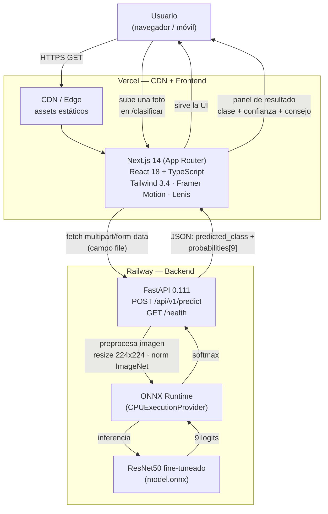

# Arquitectura del sistema — EcoClasificador

Documento de arquitectura de la aplicación EcoClasificador (UPATecO Salta, 2026).
Describe el flujo completo desde que el usuario sube una foto hasta que recibe la
clasificación del residuo en una de las 9 categorías del dataset RealWaste.

## Diagrama



## Flujo paso a paso

1. **Usuario → CDN de Vercel.** El navegador pide la app. Vercel sirve los assets
   estáticos y el HTML/JS de Next.js desde su CDN/edge.
2. **Next.js (frontend).** App Router de Next.js 14 con React 18 y TypeScript.
   UI con Tailwind 3.4, animaciones con Framer Motion 11, scroll suave con Lenis
   y carruseles con Swiper. Incluye i18n ES/EN, dark mode y accesibilidad AA.
3. **Subida de la foto.** En `/clasificar` el usuario elige o arrastra una imagen.
   El frontend la envía con `fetch` como `multipart/form-data` (campo `file`) a la
   URL de `NEXT_PUBLIC_API_URL`, que apunta al endpoint `POST /api/v1/predict` del
   backend en Railway.
4. **FastAPI (backend).** Recibe el archivo, valida que sea una imagen y se lo pasa
   al `ModelService`.
5. **Preprocesado.** La imagen se redimensiona a 224×224 (bilineal), se escala a
   [0,1], se reordena de HWC a CHW y se normaliza con las medias/desvíos de
   ImageNet (`mean=[0.485,0.456,0.406]`, `std=[0.229,0.224,0.225]`).
6. **ONNX Runtime + ResNet50.** El tensor entra al modelo `model.onnx` (ResNet50
   con transfer learning sobre RealWaste) ejecutado con ONNX Runtime
   (`CPUExecutionProvider`). Devuelve 9 logits.
7. **Softmax + respuesta.** El backend aplica softmax, ordena las probabilidades y
   responde un JSON: `predicted_class` (clase ganadora) y `probabilities` (lista de
   las 9 clases con su probabilidad).
8. **Panel de resultado.** El frontend muestra la clase predicha, la confianza, un
   consejo de reciclaje asociado y un botón para clasificar otra foto. El resultado
   se anuncia con `aria-live="polite"` para lectores de pantalla.

## Componentes y responsabilidades

| Capa | Tecnología | Responsabilidad |
|---|---|---|
| Entrega | Vercel CDN | Servir el frontend estático cerca del usuario |
| Frontend | Next.js 14 / React 18 / TS | UI, i18n, dark mode, a11y, captura de la foto |
| Transporte | HTTPS + multipart/form-data | Enviar la imagen al backend |
| API | FastAPI 0.111 | Validación, orquestación, serialización JSON |
| Inferencia | ONNX Runtime | Ejecutar el grafo del modelo en CPU |
| Modelo | ResNet50 (ONNX) | Clasificar en 9 categorías RealWaste |
| Hosting backend | Railway (Docker) | Correr el contenedor de la API |

## Contrato de la API

```
GET  /health                 -> 200 {"status":"ok"}
GET  /                        -> 200 {name, version, docs, predict}
POST /api/v1/predict          (multipart/form-data, campo "file": imagen)
                             -> 200 {
                                  "predicted_class": "Plastic",
                                  "probabilities": [
                                    {"class_name": "Plastic", "probability": 0.87},
                                    {"class_name": "Glass",   "probability": 0.06},
                                    ...  // las 9 clases, ordenadas desc
                                  ]
                                }
```

Las 9 clases: Cardboard, Food Organics, Glass, Metal, Miscellaneous Trash, Paper,
Plastic, Textile Trash, Vegetation.

> Nota: las métricas de exactitud del modelo (accuracy / F1 por clase / matriz de
> confusión) sobre el conjunto de test están **pendientes de medición** y se
> reportarán en la entrega final. No se incluyen valores estimados.
